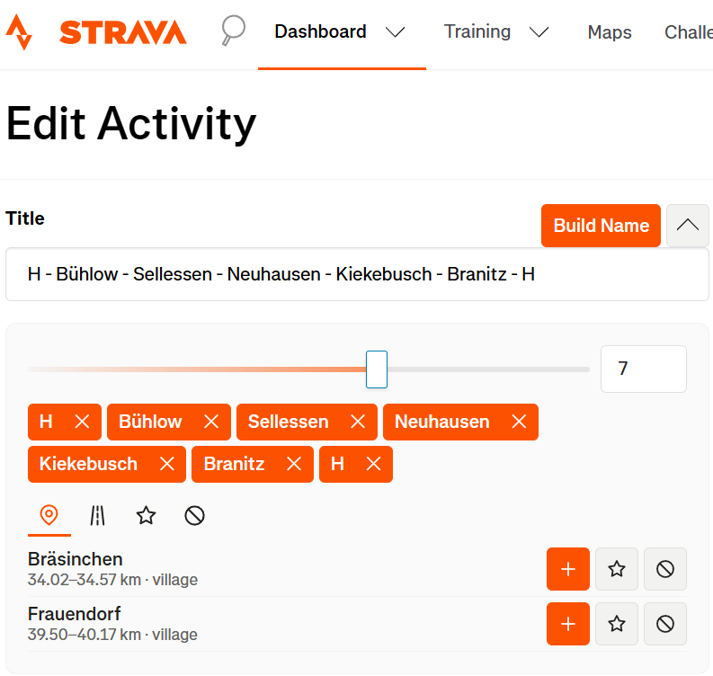

# Strava Activity Renamer

Strava activity names from OpenStreetMap
places along the route.

## Naming

- Orders visited places along the route.
- Merges one continuous visit but preserves later revisits.
- Prioritizes settlements; named roads fill gaps.
- Selects geographically spread places and keeps the route ends.
- Applies Favorites and manual choices; removes middle places if the title is too
  long.

## Installation

1. Install [Tampermonkey](https://www.tampermonkey.net/).
2. In Chrome or Edge 138+, open Tampermonkey's extension settings and enable
   **Allow User Scripts**.
3. Open [Activity Renamer](https://raw.githubusercontent.com/rrokot/activity-renamer/master/activity-renamer.user.js).
4. Confirm the installation.

## Usage

1. Open a Strava activity's edit page.
2. Click **Build Name**.
3. Optionally open the arrow beside the controls to edit the result inline.
4. Save the activity.

## Inline editor

- Add, rename or remove places for the current activity.
- Adjust the 2–10 place slider above the name chips, or enter a larger number
  in the linked field; it starts at the calculated value for this activity.
- Set the permanent automatic density as kilometres of map span per place.
- Browse unused route places and named roads in separate tabs.
- Save preferred place names for future activities in **Favorites**.
- Manage unwanted names separately in **Excluded**.
